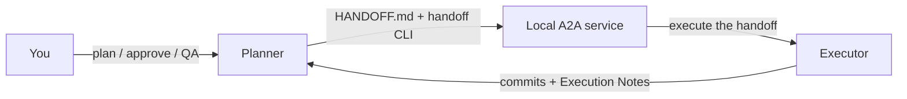

# handoff-automation

Run a coding task with two AI agents: a **Planner** that writes the plan and
reviews the result, and an **Executor** that implements it. You approve the
plan and decide when to merge.

The Executor can be Claude Code, Codex, or Cursor CLI. The Planner is any of
those hosts, with its own model. After a one-time setup you talk only to the
Planner; it runs the `handoff` CLI for you.

[Quick start](#quick-start) · [Usage](#usage) · [For agents](#for-agents) ·
[Status](#status-and-limitations) · [Development](#development) ·
[Docs](#documentation)

## How it works



1. The Planner writes a self-contained plan in `HANDOFF.md` as a **DRAFT**.
2. You approve it in chat.
3. The CLI starts the Executor with fresh context on the approved plan.
4. The Planner reviews the actual Git diff and tests, then writes
   **CHANGES REQUESTED** or **APPROVED**.

Each task gets a bounded number of Executor runs (three by default). The Planner never approves its
own plan, and nothing is pushed or merged for you.

## Requirements

- Git, Bash, and `jq` 1.7+
- Python 3.11+ and [`uv`](https://docs.astral.sh/uv/)
- The CLI for each Executor you want, installed and logged in
- A Planner agent that can edit your repository and run commands

Live checks ran on macOS. Other platforms are not yet validated.

## Quick start

**1. Install from source**

```sh
git clone https://github.com/dxd-dechao/handoff-automation.git
cd handoff-automation
uv sync
export PATH="$PWD/bin:$PATH"   # add to your shell profile to keep it
```

**2. Log in to your Executor provider** (once; the Planner tells you if a
login is missing)

| Executor | CLI | Login |
| --- | --- | --- |
| Claude Code | `claude` | `claude /login` |
| Codex | `codex` | `codex login` |
| Cursor | `cursor-agent` | `cursor-agent login` |

**3. Give your Planner the skill**

```sh
handoff skill install "/path/to/project" --host claude   # or cursor, codex; --user for all repos
```

**4. Ask your Planner to set it up**

> /handoff-cli set up handoff in this repo

It asks, in one round, for the Executor provider, the model (from the IDs
your CLI reports), and the run mode. Then it starts the local service. It
never picks these for you.

> [!NOTE]
> **Sandboxed Planner shells** can block `ps` and localhost, so `status`
> reports `unknown (probe not permitted)` and `execute` cannot reach the
> service. On Claude Code, add both user settings: the `handoff` sandbox
> exclusion and the allow rules. `handoff preflight` lists every blocker
> before dispatch. See
> [When the Planner's host blocks local commands](docs/cli-setup-and-models.md#when-the-planners-host-blocks-local-commands).

## Usage

Talk to the Planner:

| You say | What happens |
| --- | --- |
| "Plan \<task\> in the handoff" | Writes a DRAFT and stops for your review |
| "Approved" | Records approval, then runs the Executor (drive) or leaves it to your watcher (watch) |
| "QA the handoff" | Reviews the diff and checks, writes CHANGES REQUESTED or APPROVED |
| "Handoff status" | Status, execution state, whose turn it is |
| "Switch the Executor to \<model\>" | Changes it now, or after the current run |
| "Switch to watch mode" / "drive mode" | Changes only the run mode |
| "Resume the run" / "Cancel the run" | Reconnects to or stops an outstanding run |

**Run modes.** In **drive**, the Planner starts each run and QAs it in the
same chat. In **watch**, you keep `handoff watch "/path/to/project"` open in
a terminal. It dispatches each approved run, and you ask for QA when it
notifies you. Choose watch for long runs or to keep the chat free.

**Model switching** keeps the approval, history, round count, and Git state.
Details: [model guide](docs/cli-setup-and-models.md#6-change-the-executor-model-within-a-workflow).

**Legacy mode** runs Claude Code directly, with no Python or local service.
It has no model switching. See [Advanced setup](docs/advanced-setup.md).

## For agents

Reading this repository does not activate the handoff protocol. Use it only
when the human asks for a handoff workflow.

- **Planner:** follow [`skills/handoff-cli/SKILL.md`](skills/handoff-cli/SKILL.md).
  Keep new plans as DRAFT until the human approves them. Read state with
  `--json`. QA the diff, not the Executor's notes.
- **Executor:** implement the Current Task in `HANDOFF.md` directly. Edit
  only its Status line and Execution Notes. Do not run `handoff`, the
  Planner skill, or another agent.

There are no `handoff plan`, `qa`, or `drive` commands; those are agent work.

## Status and limitations

Current evidence, 2026-09-25:

- **214 Python tests and 24 legacy smoke checks** pass
  ([A8 report](docs/qa-a8-preflight-sandbox.md)).
- A live **Claude Code Planner** (auto mode, sandboxed shell) drove a live
  **Cursor Executor** (`grok-4.7-high-fast`) through two drive-mode rounds.
  The second round fixed QA feedback and was approved (A8).
- A live **Cursor CLI Planner** ran the setup interview through to a DRAFT
  ([A7](docs/qa-a7-skill-first-setup.md)). Cursor Grok and Composer
  Executors and model switches were checked live
  ([A6](docs/qa-a6-cli-usability.md)).

Known limits:

- Not yet checked live:
  - a Codex Planner host;
  - skill discovery in the Cursor Editor;
  - queued `--after-current` switches.
- No cross-provider correction has succeeded live yet. In A6, a Codex
  correction round edited Planner-owned QA text, and its delivery was
  rightly rejected. Earlier Claude–Codex checks are
  [recorded separately](docs/a2a-replacement-results.md).
- Credential filtering is not OS-level account isolation. User-level Cursor
  rules and skills can reach the Executor.
- One local checkout and one active task at a time. Third-party A2A servers
  are untested.
- None of this measures coding quality, speed, or cost.

## Development

```sh
uv sync --extra test
bash -n bin/handoff
bash tests/smoke-manifest.sh
uv run --offline --extra test python -m pytest -q
git diff --check
```

Tests use fake providers and make no paid calls. Service tests need local
process and localhost access, so run them outside a sandboxed shell. Live
checks in `scripts/` need `--confirm-live` and make paid calls.

| Path | Contents |
| --- | --- |
| `bin/handoff` | Public CLI |
| `src/handoff_a2a/` | A2A service, adapters, setup, recovery |
| `skills/handoff-cli/` | Planner skill |
| `templates/` | `HANDOFF.md` protocol and permission templates |
| `tests/`, `scripts/` | Automated and live checks |
| `docs/` | Guides and recorded QA evidence |

## Documentation

- [CLI setup, models, run modes, and recovery](docs/cli-setup-and-models.md)
- [Advanced setup: legacy mode and manual A2A endpoints](docs/advanced-setup.md)
- [A2A coding-task protocol](docs/a2a-coding-task-v1.md)
- QA evidence: [A8](docs/qa-a8-preflight-sandbox.md) ·
  [A7](docs/qa-a7-skill-first-setup.md) · [A6](docs/qa-a6-cli-usability.md)
- [Product status](docs/product-status.md) ·
  [Implementation history](docs/implementation-plan.md)
